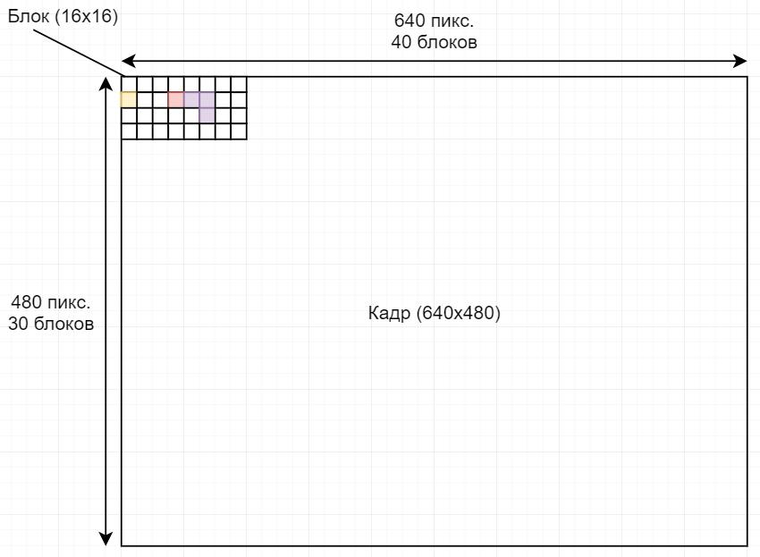
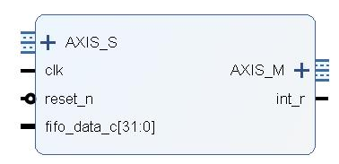
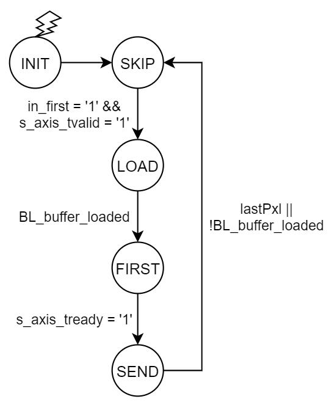
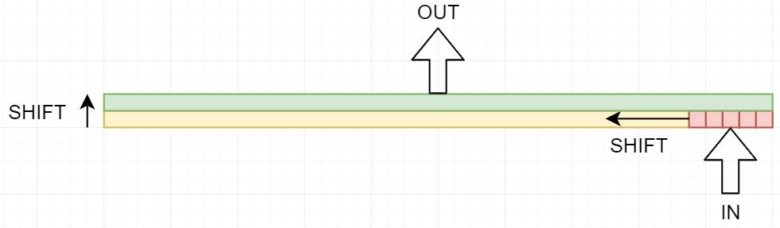
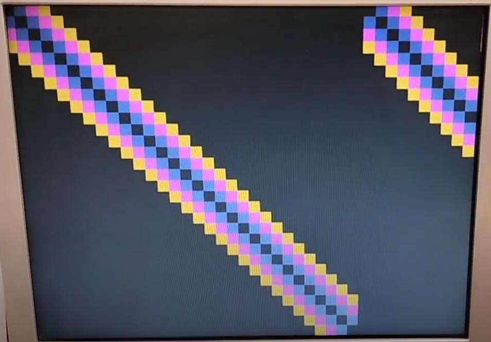
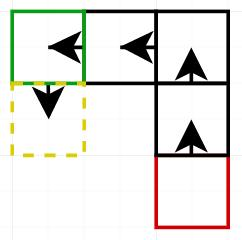

Ускоритель для игры "Змейка", совместимый с модулем AXIS2VGA.

# Логика работы
Принцип работы ускорителя основан на разделении изображения на блоки. Поскольку сама игра изначально предполагала движение змейки "рывками" и отсутствие излишней детализации, можно упростить изображение до сетки из блоков четырёх типов: пустота, тело змеи, голова змеи и еда.

При размере изображения 640х480 и размере блока 16х16 размер закодированного изображения сокращается до 40х30.



Тип блока можно закодировать в 2 битах:
```vhdl
constant BBITS: integer := 2; -- bits per block
constant B_EMPTY: std_logic_vector(1 downto 0) := "00"; -- 0
constant B_SNAKE: std_logic_vector(1 downto 0) := "01"; -- 1
constant B_HEAD: std_logic_vector(1 downto 0) := "10"; -- 2
constant B_FOOD: std_logic_vector(1 downto 0) := "11"; -- 3
```

# Модуль DOG2AXIS
## Входы и выходы
Модуль-ускоритель DOG2AXIS работает с 2 интерфейсами AXI4-Stream.

Входной интерфейс использует 10 бит (9:0) для передачи данных (таким образом, передавая 5 блоков за транзакцию), один бит для сигнала `first` (15) (аналогично AXIS2VGA, подаётся перед началом кадра) и один бит для сигнала `finish` (14), который никому не нужен, но тоже есть для сходства, отладки и красоты. Два бита (13:12) не используются - ограничение длины транзакции пятью блоками позволяет избежать транзакций переменной длины (поскольку все стандартные размеры VGA делятся на 16*5=80).

Выходной интерфейс построен для совместимости с AXIS2VGA: 4 бита на каждый цвет, а также сигналы `first` и `finish`.

Помимо входного и выходного AXIS-интерфейсов он также имеет вход `fifo_data_c` и выход прерывания `int_r`. Принцип работы последних двух сигналов аналогичен их функционалу в AXIS2VGA: когда в очереди остаётся мало данных (около 40 транзакций, что равно 200 блокам или 5 "строкам" блоков), подаётся запрос на CPU для передачи сследующего кадра.



## Архитектура
Поскольку одна "строка" блоков соответствует 16 строкам реального изображения, требуется сохранение 40 блоков (1 "строка") в памяти. Кроме того, для ~~неизвестно чего~~ обработки ситуации с неравномерной подачей данных или ~~невозможными~~ специфическими видеорежимами добавлен дополнительный буфер (сдвиговый регистр) следующей строки, позволяющая загружать данные непосредственно во время вывода изображения.

Последовательная логика разделена на 3 процесса - автомат состояний, управление загрузкой буферов и счётчик выходных пикселей.

### Автомат состояний
Автомат состояний схож с AXIS2VGA, с учётом нескольких доработок:

* IDLE - начальное состояние после сброса, ничего не передаётся и не принимается
* SKIP - пропуск входных данных до обнаружения `first` (15) на входе (включительно)
* LOAD - загрузка данных в очередь до готовности первого буфера
* FIRST - вывод сигнала `first` (13) на выход до обнаружения его AXIS2VGA
* SEND - отправка данных до конца кадра или ошибки их получения

Переходы между состояниями отображены на диаграмме.



```vhdl
lastPxl <= state = SEND and h_cnt = HAV-1 and v_cnt = VAV-1 and m_axis_tready = '1';
```

### Механизм загрузки
```vhdl
moving <= BL_shift_loaded and (not BL_buffer_loaded or lastInBL);
can_load <= (state = LOAD or state = FIRST or state = SEND) and in_first = '0' and (not BL_shift_loaded or moving);
loading <= can_load and s_axis_tvalid = '1';
s_axis_tready <= '1' when can_load or state = SKIP else '0';
```
* Данные с AXIS загружаются в последние 10 бит сдвигового регистра; загрузка возможна только в том случае, когда в нём остаётся место ИЛИ он готовится к перемещению в буфер.
* В состоянии SKIP загрузка не происходит; для избежания записи мусора в конце кадра (если передано больше данных, чем нужно) состояние SKIP автоматически очищает оба буфера и сбрасывает их счётчики.
* Перемещение данных из регистра в буфер выводимой строки происходит, когда буфер ещё не загружен ИЛИ когда его данные уже не нужны (выводится последний пиксель последней строки последнего блока буфера, **и эти данные принимаются AXIS2VGA**).



### Счётчик пикселей и управление выводом
Для взаимодействия с AXIS2VGA модуль хранит позицию выводимого пикселя в активной области изображения. Увеличение счётчика происходит по сигналу `m_axis_tready`, подтверждающему получение данных.

Путём несложных вычислений (логического сдвига номера пикселя, поскольку размер блока - степень 2) определяется позиция блока в буфере, и выводится цвет, соответствующий нужному блоку. Возможны только 4 цвета, и их невозможно изменить.

Вне состояния SEND на выходах удерживается стабильный 0.

## Подключение
Подключение в Block Design осуществляется посредством размещения блока между FIFO и AXIS2VGA по интерфейсам AXIS. Клок используется тот же, что для AXIS2VGA. Сигналы `fifo_data_c` и `int_r` переключаются к DOG2AXIS, а на вход `fifo_data_c` AXIS2VGA подключается константная заглушка - на функциональность самого модуля счётчик не влияет, а его прерывания больше не нужны.


# Программы на языке C
## Тест вывода
Проект "OutputTest" реализует проверку IP-модуля путём подачи диагональной линии из блоков разного цвета (***ЭТО НЕ ЗМЕЙКА!!!***). Код программы большей частью ~~нагло позаимствован~~ повторяет базовый "кружок", с несколькими изменениями.
* Из-за новой схемы хранения данных, для хранения одного кадра достаточно `(40*30) / 5 + 1 = 241` 16-разрядных транзакции, или 482 байта. Лишняя транзакция требуется для передачи сигнала `first`.
* Поскольку размер кадра в памяти значительно уменьшился, нет необходимости разбивать передачу кадра на несколько транзакций. Весь кадр передаётся целиком.
* Генерация тестового изображения вынесена в функцию `testFrame(u16 *frame, int shift)`.
* Расположением линии всё также можно управлять посредством клавиш W,A,S,D.



## Консольный вариант
Для тестирования и отладки основных функций была реализована консольная версия игры, использующая билиотеку `<curses.h>`.
Программа прилагается в файле [snek_curses.c](snek_curses.c) и предназначена для компиляции и запуска на Unix-платформах.

## Финальная реализация
Проект "DoGGame" содержит саму игру и состоит из 3 файлов:
* helloworld.c - сама игра
* xorwow.h - генератор псевдослучайных чисел
* inbyte_nb.h - неблокирующая реализация функции `inbyte()` для считывания нажатых клавиш

### Основные типы
В файле игры определяются базовые типы (блок, позиция) и константы (типы блоков, направления).

"Блок" на поле (до его сохранения в кадровый буфер) содержит не только тип блока, но и направление, в котором он двигается - это необходимо для передвижения самой змеи.
```c
typedef struct block_s {
    u8 val;
    u8 dir;
} block_t;
```

Структура состояния игры (`gameState_t`) хранит всю информацию об игре, включая карту поля. Поскольку каждый блок поля может быть закодирован 4 битами (2 под тип, 2 под направление), для экономии места в один байт записываются два блока.
```c
typedef struct gameState_s {
    u8 map[SIZE_X/2][SIZE_Y];
    pos_t head;
    pos_t tail;
    int snakeLen;
    u8 freeze;
    u8 lastHeadDir;
} gameState_t;
```
Основные поля:
* map - карта блоков, 2 блока на байт
* head - позиция головы
* tail - позиция хвоста
* snakeLen - текущая длина змеи
* freeze - флаг "заморозки" игры, устанавливается при победе/поражении, а также в самом начале игры
* lastHeadDir - последнее направление движения головы.

### Функции игры
Определены функции `block_t getBlock(gameState_t *gameState, pos_t pos)` и `void setBlock(gameState_t *gameState, pos_t pos, block_t block)` для получения и записи блоков из карты.

Функция `void addFood(gameState_t *gameState, int cnt)` добавляет нужное количество еды на карту, используя псевдослучайный генератор xorwow для определения позиции.
В случае, если змея слишком длинная (занимает 3/4 площади карты), для избежания слишком долгого перебора выбирается место вокруг хвоста в пределах 5 блоков - там гарантированно будут свободные клетки.
В последние моменты игры (когда свободных блоков нет), еда не размещается вообще.

Функция `void resetState(gameState_t *gameState)` сбрасывает игру на начальное состояние, размещая щмею посередине экрана и отменяя "заморозку".

Обработка клавиш происходит при помощи функции `void handleKey(gameState_t *gameState, char key)`, меняющая направление дальнейшего движения змеи. В случае "заморозки" состояния оно сбрасывается.
Для изменения направления головы используется функция `void setHeadDir(gameState_t *gameState, u8 dir)`. При каждом вводе проверяется, чтобы поворот не был на 180° от последнего направления движения.

Основная логика размещена в функции `void advanceGame(gameState_t *gameState)`. Поскольку в каждом блоке туловища сохраняется его направление, нет смысла "двигать" всю змею, достаточно переместить голову (отметить её старое место как туловище), а также сдвинуть хвост.


После проверки условий победы (максимальная длина) и поражения (столкновение головы со стенами/телом змеи) происходит перемещение головы и хвоста. В случае, если голова перемещается на еду, хвост остаётся на месте, а длина змеи увеличивается. Также происходит попытка разместить новую еду.

### Вывод кадра
Механика вывода ничем принципиально не отличается от проекта "OutputTest". Перед стартом первой игры выводится та же диагональная линия. "Заморозка" (победа/поражение) отражается рамкой по краям экрана. Для начала игры достаточно нажать любую клавишу.

### Замер времени
Для замера времени используется `XTime_GetTime(&XTime)`. В каждый игровой "такт" идёт циклическая проверка вводимых клавиш до тех пор, пока таймер не перейдёт установленное значение, после чего состояние игры меняется.
```c
...
new_frame_ready = 1;
//record current time
XTime_GetTime(&t_last);
t_cur = t_last;
while (t_cur - t_last <= GAME_SPEED_SECONDS * COUNTS_PER_SECOND/4) {
    key = inbyte_nb(); //try to get inbyte
    if (key != -1) handleKey(&gameState, (char)key);
    XTime_GetTime(&t_cur);
}
advanceGame(&gameState);
//ready to output a new frame!
```

# Видео с демонстрацией
[](https://youtu.be/oz1PvVIvSVA)

# Итоги
* Объём передаваемых данных сократился на 99.92%
* Разработана *инновационная* игра "змейка" для импортозамещения на не совсем импортозамещённой млате
* Сделана отсылка к Calamity Mod в названии проекта и цвете "змейки"
* ...
* П͎̱͇̲͇͔͈͙̬̱̎̓͂͂О̫̣̣̫̩̣͐̽̋̉̔́͒̅̎̑С̘͈͓̲̱͖͖̳͙͙͓̎͋͂́̉̊̓̑Т̲͉̮͓͎̬̫̬́̄̏̏̇͐͋͊А͖̗̥̗̥̯͚̭͈͚͈͑̀̇̔̉̏ͅВ͎͇͕̫̝̠̱̈̓̆̑̀͂́̐͂̍͛Ь̰̞̩̥͛̍̃̔̈̔̈̅̇̈ͅТ͚͕͖̘̞̘̬̟̱̽͋̂̆̽̾Е̤̠̰̠̭̪̍͆̈́̚ Ӑ̘͖̳̟͙̰͔̞͕̒͋̀͌̓В͎̞̬̲̣̝͊́̅̍́̆̀͌ͅТ͇̭͍̙̘̙̥͒̈͐̎О̳̘̘̫͉̥͍̉͊̂̓̑̆͊̍̚М͇͕͙̳̀̄͆͊͗̀̃А͕͚̫̭͗́̈́̾͆͊͒̉̓̒Т͇̬͖͎̩̦̘͉͚͈̥̇̆̎̒̏̊̊͂̿̋͑